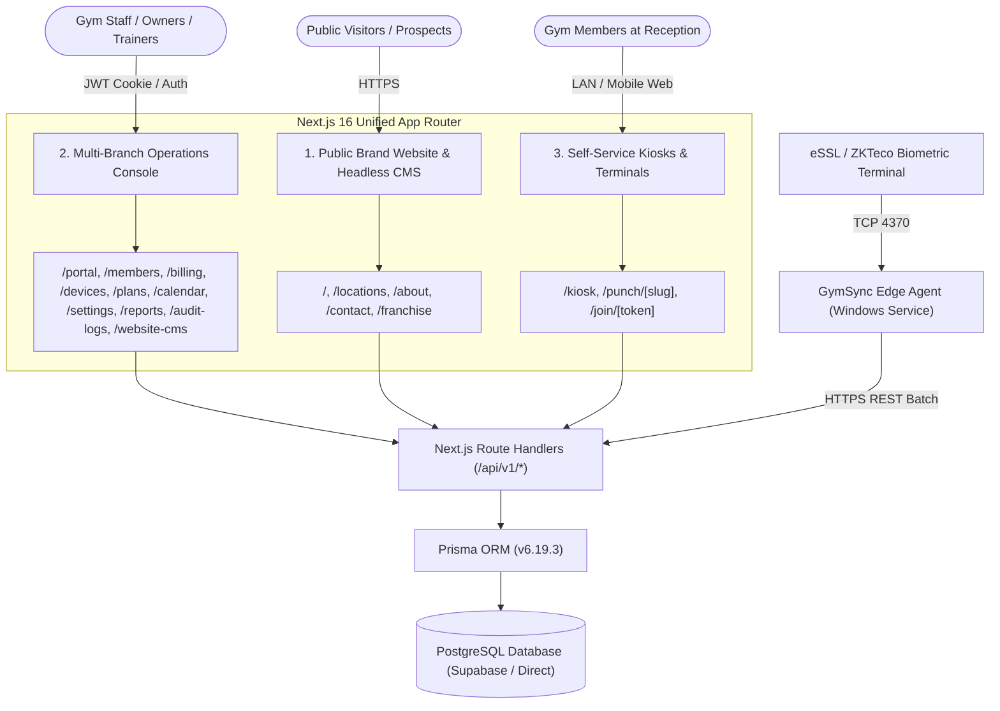

# PRD-01: Product Overview & System Architecture
## Be Free Fitness (BFF) — Enterprise Gym Management SaaS Platform

**Document Version:** 1.0.0  
**Scope:** High-Level Product Architecture, Design Principles, and Technology Stack  

---

### 1. Executive Summary & Product Vision

**Be Free Fitness (BFF)** is an enterprise-grade Gym Management Operating System engineered specifically for multi-branch gym chains and high-volume fitness clubs. It bridges physical gym floor operations with a modern digital management platform.

Unlike generic international gym CRMs, the platform solves core statutory and operational pain points unique to high-performance fitness chains in India:
1. **Statutory Indian GST Compliance:** Full automated tax calculation under SAC Code `999723` (intra-state 9% CGST + 9% SGST vs. inter-state 18% IGST) and Indian Financial Year sequential numbering (e.g. `FZ/26-27/0001`).
2. **On-Premise Biometric Turnstile Integration:** Hardware integration with eSSL / ZKTeco biometric terminals through a background edge daemon (`GymSync`) with cryptographic sliding-window deduplication.
3. **Omnichannel Member Engagement:** Meta WhatsApp Cloud API integration for automated morning birthday greetings and membership expiry warnings (7, 3, and 1 days prior).
4. **Frictionless Mobile Member Onboarding:** Cryptographically signed invite links allowing incoming prospects to complete KYC, select membership plans, and generate digital membership passes without staff data entry.
5. **Multi-Branch Multi-Tenancy:** Instant location switching in the header, independent branch billing prefixes, and centralized management.

---

### 2. System Personas & User Roles

| Persona / Role | System Access | Primary Responsibilities & Workflows |
| :--- | :--- | :--- |
| **Super Admin** | Global Platform | Cross-tenant oversight, billing plan definitions, system infrastructure diagnostics. |
| **Gym Owner** | Enterprise Tenant | Complete control over tenant settings, staff accounts, multi-branch network, financial reports, refunds, plan modifications. |
| **Manager** | Branch Console | Operational control over branch staff, member onboarding, attendance audits, plan allocation, promotional broadcasts. |
| **Front Desk Receptionist** | Front Desk / Kiosk | Fast member check-in verification, payment collection (Cash/UPI/Card), manual attendance overrides, member profile lookup. |
| **Trainer** | Member Records | Viewing assigned member lists, tracking member attendance consistency, reviewing member health metrics. |
| **Accountant** | Financial Console | Reviewing statutory GST reports, inspecting payment receipts, monitoring receivables, issuing authorized refunds. |
| **Member / Prospect** | Public / Self-Portal | Viewing gym locations and amenities, booking club visits, self-registering via invite links, self-check-in at terminal. |

---

### 3. Dual-Portal System Architecture

The application operates as a cohesive unified Next.js 16 deployment with three distinct access surfaces:



#### Portal 1: Public Athletic Luxury Brand Experience
* **Routes:** `/`, `/locations`, `/locations/[slug]`, `/about`, `/contact`, `/franchise`.
* **Purpose:** High-conversion brand storefront showcasing gym locations (e.g. Dhalpur, Gandhinagar, Akhara Bazar, Bajaura, Sudhowala, Prem Nagar), equipment highlights, luxury amenities (Olympic lifting decks, Finnish saunas, protein bars), and lead generation modals.
* **Content Management:** Fully customizable via the internal Headless CMS (`/website-cms`), synchronizing content without code redeployments.

#### Portal 2: Enterprise Operations Management Console
* **Routes:** `/portal`, `/members`, `/members/[id]`, `/billing`, `/plans`, `/devices`, `/calendar`, `/settings`, `/reports`, `/audit-logs`, `/website-cms`.
* **Purpose:** Mission-critical administrative interface for staff and management, secured behind HTTP-only JWT sessions, role-based access control, and tenant context isolation.

#### Portal 3: Front-Desk High-Speed Kiosks & Self-Punch Terminals
* **Routes:** `/kiosk` (staff fast-punch console), `/punch/[slug]` (member self-check-in tablet terminal), `/join/[token]` (tamper-proof self-registration portal).
* **Purpose:** Lightweight, high-throughput interfaces designed for zero latency, tactile touch interactions, and real-time biometric and RFID card synchronization.

---

### 4. Technology Stack Specifications

#### Core Framework & Runtime
* **Framework:** Next.js 16.3.5 (App Router architecture with React Server Components and Client Components).
* **UI Library:** React 19.2.8.
* **Language:** TypeScript 5 (Strict type checking, end-to-end interface integrity).
* **Styling Engine:** Tailwind CSS v4 (`@tailwindcss/postcss`). Custom theme featuring dark luxury aesthetics, glassmorphism (`backdrop-blur`), and emerald accents.
* **Icons:** `lucide-react` (v1.46.0).

#### Data Layer & Persistence
* **Database:** PostgreSQL (Compatible with Supabase PostgreSQL 15/16, AWS RDS, or Embedded Postgres for local zero-dependency testing).
* **ORM:** Prisma ORM (v6.19.3) with `@prisma/client`.
* **Connection Pooling:** Supports PgBouncer / Supabase Transaction pooler on port 6543 (`DATABASE_URL`) with direct connection fallback on port 5432 (`DIRECT_URL`).
* **Binary Targets:** `native`, `rhel-openssl-3.0.x` (ensuring compatibility with Vercel serverless Linux runtimes).

#### Security & Cryptography
* **JWT Engine:** `jose` (v6.2.12) utilizing standard HS256 symmetric algorithms.
* **Password Hashing:** `bcryptjs` (v3.0.3) with cost factor 10, accompanied by synthetic dummy hash comparisons to prevent user enumeration timing attacks.
* **Schema Validation:** `zod` (v4.6.5) strictly validating all incoming API payloads and environment variables.
* **Timing-Safe HMAC:** Node.js native `crypto.timingSafeEqual` protecting webhook signatures against side-channel timing attacks.

#### Utilities & Integration Libraries
* **QR Code Generation:** `qrcode` (v1.5.4) generating SVG and high-resolution base64 PNG data URLs.
* **Date Manipulation:** `date-fns` (v4.4.0) managing Indian Financial Year calculations, subscription durations, and freeze periods.
* **Class Utilities:** `clsx` (v2.1.1) and `tailwind-merge` (v3.7.0) with `class-variance-authority`.

---

### 5. Multi-Tenancy Architecture & Data Isolation

The platform utilizes a **Shared Database, Tenant Discriminator** multi-tenancy model:
1. Every core data entity (`User`, `Member`, `MembershipPlan`, `Membership`, `Invoice`, `Payment`, `Device`, `AttendanceRecord`, `NotificationTemplate`, `CalendarEvent`, `AuditLog`) enforces a mandatory foreign key reference to `Tenant.id`.
2. All Prisma queries executed within API route handlers and server components inject `tenantId` derived from the cryptographically verified staff JWT session:
   ```typescript
   where: { tenantId: session.tenantId, ...filter }
   ```
3. Compound unique constraints guarantee isolation across tenants (e.g. `[tenantId, memberCode]`, `[tenantId, phone]`, `[tenantId, invoiceNumber]`, `[tenantId, deviceSerialNumber]`). This permits multiple branches or independent gyms to use simple sequential identifiers without collisions.
