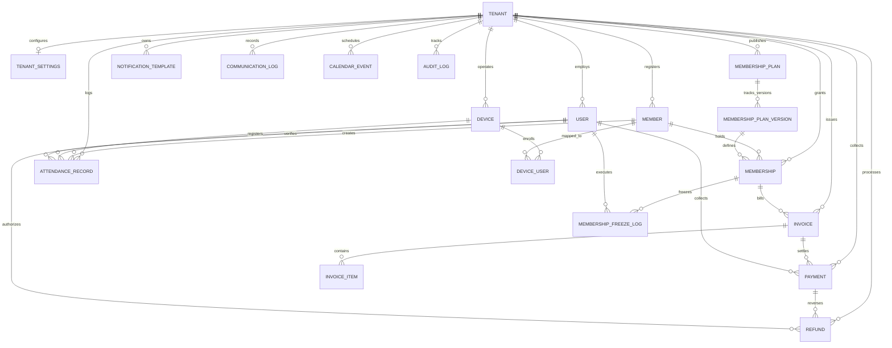

# PRD-02: Data Model & Database Schema Specification
## Be Free Fitness (BFF) — Enterprise Gym Management SaaS Platform

**Document Version:** 1.0.0  
**Scope:** Complete Database Schema, Entity Relationships, Constraints, and Data Dictionaries  

---

### 1. Entity-Relationship Overview

---

### 2. Enumeration Types (Enums)

| Enum Name | Permitted Values | Business Description |
| :--- | :--- | :--- |
| `UserRole` | `SUPER_ADMIN`, `GYM_OWNER`, `MANAGER`, `FRONT_DESK`, `TRAINER`, `ACCOUNTANT` | Defines staff authority and accessible console modules. |
| `MemberStatus` | `LEAD`, `ACTIVE`, `EXPIRING_SOON`, `EXPIRED`, `FROZEN`, `SUSPENDED`, `CANCELLED` | Lifecycle state of gym members and subscription validity. |
| `GenderType` | `MALE`, `FEMALE`, `OTHER`, `UNDISCLOSED` | Member profile demographic classification. |
| `InvoiceStatus` | `DRAFT`, `ISSUED`, `PARTIALLY_PAID`, `PAID`, `CANCELLED`, `REFUNDED` | Statutory invoice billing and payment collection state. |
| `PaymentMode` | `CASH`, `UPI`, `CARD`, `NETBANKING`, `CHEQUE`, `ONLINE_PAYMENT_GATEWAY` | Payment tender methods accepted at POS. |
| `DeviceProtocol` | `ZK_LAN_DIRECT`, `ADMS_PUSH`, `ETIMETRACK_DB_SYNC` | Hardware network protocol for biometric attendance machines. |
| `ChannelType` | `WHATSAPP`, `EMAIL`, `IN_APP`, `SMS` | Communication dispatch delivery pipelines. |
| `MessageStatus` | `QUEUED`, `SENT`, `DELIVERED`, `READ`, `FAILED`, `REJECTED` | Message lifecycle status for omnichannel notifications. |

---

### 3. Detailed Data Dictionary

#### 3.1 `tenants` (Multi-Branch Tenant Entity)
Root entity representing an individual gym location or enterprise chain.

| Column | Type | Nullable | Default | Description |
| :--- | :--- | :--- | :--- | :--- |
| `id` | `String (UUID)` | No | `uuid()` | Primary Key. |
| `slug` | `String` | No | — | Unique URL identifier (e.g. `dhalpur-kullu`, `befree-gym`). |
| `business_name` | `String` | No | — | Display business name. |
| `legal_name` | `String` | Yes | — | Registered corporate/GST legal entity name. |
| `gstin` | `String` | Yes | — | 15-character Indian GST Identification Number. |
| `phone` | `String` | No | — | Primary business contact telephone. |
| `email` | `String` | No | — | Primary business email. |
| `address` | `Json` | No | — | Structural JSON: `{ street, city, state, postalCode, country }`. |
| `logo_url` | `String` | Yes | — | Public URL to brand emblem/logo. |
| `currency` | `String` | No | `"INR"` | ISO currency code. |
| `timezone` | `String` | No | `"Asia/Kolkata"` | Standard IANA timezone identifier. |
| `is_active` | `Boolean` | No | `true` | Operational status flag. |
| `created_at` | `DateTime` | No | `now()` | Record creation timestamp. |
| `updated_at` | `DateTime` | No | Auto | Record modification timestamp. |

#### 3.2 `tenant_settings` (Branch Operational Configuration)
Tenant-specific billing, tax, and automation preferences.

| Column | Type | Nullable | Default | Description |
| :--- | :--- | :--- | :--- | :--- |
| `tenant_id` | `String (UUID)` | No | — | Primary Key / Foreign Key to `tenants.id` (`onDelete: Cascade`). |
| `invoice_prefix` | `String` | No | `"INV"` | Prefix used in FY invoice generation (e.g. `FZ`, `BFF`). |
| `invoice_financial_year_restart`| `Boolean` | No | `true` | Resets sequence counter to `0001` every April 1st. |
| `enable_gst` | `Boolean` | No | `true` | Determines whether invoices calculate tax breakdowns. |
| `gst_rate_percentage` | `Decimal(5,2)` | No | `18.00` | Statutory GST rate (standard 18.00%). |
| `attendance_duplicate_window_minutes` | `Int` | No | `5` | Sliding window in minutes for biometric dedup hashing. |
| `auto_whatsapp_birthdays` | `Boolean` | No | `false` | Enables 06:00 AM automated birthday greeting dispatch. |
| `auto_whatsapp_reminders` | `Boolean` | No | `true` | Enables automated membership expiration notices. |
| `reminder_schedule_days_before` | `Int[]` | No | `[7, 3, 1]` | Array of day offsets prior to expiration to trigger alerts. |
| `upi_id` | `String` | Yes | — | Payee VPA address for static & dynamic QR (e.g. `gym@icici`). |
| `upi_merchant_name` | `String` | Yes | — | Payee legal merchant name for UPI intent protocol. |

#### 3.3 `users` (Staff & Administrative Accounts)
Staff authentication records and operational profiles.

| Column | Type | Nullable | Default | Description |
| :--- | :--- | :--- | :--- | :--- |
| `id` | `String (UUID)` | No | `uuid()` | Primary Key. |
| `tenant_id` | `String (UUID)` | Yes | — | Foreign Key to `tenants.id` (`onDelete: Cascade`). Null for Super Admin. |
| `email` | `String` | No | — | Login email. Unique per tenant via `[tenant_id, email]`. |
| `password_hash` | `String` | No | — | Salted bcrypt password hash. |
| `full_name` | `String` | No | — | Staff full name. |
| `phone` | `String` | Yes | — | Staff contact mobile number. |
| `role` | `UserRole` | No | — | Enum defining access permissions. |
| `is_active` | `Boolean` | No | `true` | Account active state. |
| `two_factor_secret` | `String` | Yes | — | Base32 TOTP secret key for multi-factor authentication. |
| `two_factor_enabled` | `Boolean` | No | `false` | Flag indicating 2FA enforcement. |
| `last_login_at` | `DateTime` | Yes | — | Timestamp of most recent successful login. |

#### 3.4 `members` (Member Master Profiles)
Comprehensive record of all registered gym members and leads.

| Column | Type | Nullable | Default | Description |
| :--- | :--- | :--- | :--- | :--- |
| `id` | `String (UUID)` | No | `uuid()` | Primary Key. |
| `tenant_id` | `String (UUID)` | No | — | Foreign Key to `tenants.id` (`onDelete: Cascade`). |
| `member_code` | `String` | No | — | Alphanumeric Member Code (e.g. `FZ-1001`). Unique per tenant. |
| `first_name` | `String` | No | — | Member first name. |
| `last_name` | `String` | No | — | Member surname / family name. |
| `gender` | `GenderType`| No | — | Demographic gender identity. |
| `date_of_birth` | `Date` | Yes | — | Date of birth for age and automated birthday reminders. |
| `phone` | `String` | No | — | Primary mobile phone. Unique per tenant. |
| `whatsapp_number` | `String` | Yes | — | WhatsApp phone if distinct from primary mobile. |
| `email` | `String` | Yes | — | Member email address for digital receipts and alerts. |
| `photo_url` | `String` | Yes | — | Stored URL to member profile photograph. |
| `address` | `Json` | Yes | — | Address JSON `{ street, city, state, postalCode }`. |
| `emergency_contact_name` | `String` | Yes | — | Emergency next of kin name. |
| `emergency_contact_phone`| `String` | Yes | — | Emergency contact telephone number. |
| `assigned_trainer_id` | `String (UUID)`| Yes | — | Foreign Key to `users.id` (`onDelete: SetNull`). |
| `status` | `MemberStatus` | No | `ACTIVE` | Operational lifecycle status. |
| `health_metrics` | `Json` | Yes | `"{}"` | Dynamic JSON `{ weightKg, heightCm, bmi, medicalNotes, bloodGroup }`. |
| `custom_fields` | `Json` | Yes | `"{}"` | Extensible JSON `{ doorLockUid, cardNumber, referredBy, tag }`. |
| `notes` | `String` | Yes | — | General front-desk notes. |
| `is_deleted` | `Boolean` | No | `false` | Soft-deletion flag. |

#### 3.5 `membership_plans` & `membership_plan_versions` (Plan Catalog & Versioning)
Represents subscription offerings with immutable version history to protect financial auditing.

* **`membership_plans`**:
  * `id` (`String UUID`), `tenant_id` (`String UUID`), `name` (`String`), `description` (`String?`), `duration_days` (`Int`), `joining_fee` (`Decimal(10,2)`), `base_price` (`Decimal(10,2)`), `is_active` (`Boolean`).
* **`membership_plan_versions`**:
  * `id` (`String UUID`), `plan_id` (`String UUID` $\rightarrow$ `plans.id`), `version_number` (`Int`), `duration_days` (`Int`), `base_price` (`Decimal(10,2)`), `effective_from` (`DateTime`).
  * **Constraint:** Unique `[plan_id, version_number]`.

#### 3.6 `memberships` & `membership_freeze_logs` (Subscription Lifecycles)
Active and historical member subscriptions and pause periods.

* **`memberships`**:
  * `id` (`String UUID`), `tenant_id` (`String UUID`), `member_id` (`String UUID`), `plan_version_id` (`String UUID`), `start_date` (`Date`), `end_date` (`Date`), `original_end_date` (`Date`), `status` (`MemberStatus`), `frozen_days_total` (`Int` default 0), `assigned_trainer_id` (`String UUID?`).
* **`membership_freeze_logs`**:
  * `id` (`String UUID`), `membership_id` (`String UUID`), `frozen_by` (`String UUID` $\rightarrow$ `users.id`), `freeze_start_date` (`Date`), `freeze_end_date` (`Date?`), `reason` (`String?`), `unfrozen_at` (`DateTime?`).

#### 3.7 `invoices` & `invoice_items` (Statutory Invoicing & Tax Ledger)
Official Indian GST accounting records.

* **`invoices`**:
  * `id` (`String UUID`), `tenant_id` (`String UUID`), `invoice_number` (`String`), `member_id` (`String UUID`), `membership_id` (`String UUID?`), `subtotal` (`Decimal(12,2)`), `discount_amount` (`Decimal(12,2)`), `taxable_amount` (`Decimal(12,2)`), `cgst_amount` (`Decimal(12,2)`), `sgst_amount` (`Decimal(12,2)`), `igst_amount` (`Decimal(12,2)`), `total_amount` (`Decimal(12,2)`), `paid_amount` (`Decimal(12,2)`), `balance_amount` (`Decimal(12,2)`), `status` (`InvoiceStatus`), `due_date` (`Date`), `issued_at` (`DateTime`).
  * **Constraint:** Unique `[tenant_id, invoice_number]`.
* **`invoice_items`**:
  * `id` (`String UUID`), `invoice_id` (`String UUID`), `description` (`String`), `hsn_sac_code` (`String` default `"999723"`), `quantity` (`Int` default 1), `unit_price` (`Decimal(12,2)`), `taxable_value` (`Decimal(12,2)`), `gst_rate` (`Decimal(5,2)` default `18.00`), `total_item_amount` (`Decimal(12,2)`).

#### 3.8 `payments` & `refunds` (Payment Transactions)
POS payments and reverse settlements.

* **`payments`**:
  * `id` (`String UUID`), `tenant_id` (`String UUID`), `invoice_id` (`String UUID`), `member_id` (`String UUID`), `payment_number` (`String`), `amount` (`Decimal(12,2)`), `mode` (`PaymentMode`), `reference_number` (`String?` e.g. UPI UTR, Card Txn ID), `collected_by` (`String UUID` $\rightarrow$ `users.id`), `payment_date` (`DateTime`), `notes` (`String?`).
  * **Constraint:** Unique `[tenant_id, payment_number]`.
* **`refunds`**:
  * `id` (`String UUID`), `tenant_id` (`String UUID`), `payment_id` (`String UUID`), `invoice_id` (`String UUID?`), `refund_number` (`String`), `amount` (`Decimal(12,2)`), `reason` (`String`), `processed_by` (`String UUID` $\rightarrow$ `users.id`), `refunded_at` (`DateTime`).
  * **Constraint:** Unique `[tenant_id, refund_number]`.

#### 3.9 `devices`, `device_users`, & `attendance_records` (Biometrics & Turnstiles)
Hardware inventory, member RFID/biometric credential mappings, and check-in records.

* **`devices`**:
  * `id` (`String UUID`), `tenant_id` (`String UUID`), `device_name` (`String`), `serial_number` (`String`), `ip_address` (`String?`), `port` (`Int` default 4370), `protocol` (`DeviceProtocol`), `device_direction` (`String` default `"IN_OUT"`), `api_key_hash` (`String`), `last_heartbeat_at` (`DateTime?`), `firmware_version` (`String?`), `is_online` (`Boolean` default false).
  * **Constraint:** Unique `[tenant_id, serial_number]`.
* **`device_users`**:
  * `id` (`String UUID`), `tenant_id` (`String UUID`), `device_id` (`String UUID`), `member_id` (`String UUID`), `device_enrollment_id` (`Int`), `card_number` (`String?`), `privilege` (`Int` default 0), `is_synced` (`Boolean` default false).
  * **Constraints:** Unique `[device_id, device_enrollment_id]`, Unique `[tenant_id, member_id, device_id]`.
* **`attendance_records`**:
  * `id` (`String UUID`), `tenant_id` (`String UUID`), `member_id` (`String UUID`), `device_id` (`String UUID?`), `punch_time` (`DateTime`), `punch_type` (`String` default `"CHECK_IN"`), `verification_mode` (`String` default `"FINGERPRINT"`), `is_manual_entry` (`Boolean` default false), `verified_by` (`String UUID?` $\rightarrow$ `users.id`), `dedup_hash` (`String`).
  * **Constraints & Indices:** Unique `[tenant_id, dedup_hash]`, Index `[tenant_id, punch_time]`, Index `[member_id, punch_time]`.

#### 3.10 `notification_templates` & `communication_logs` (Communications)
Meta WhatsApp Cloud API and email templates and message delivery records.

* **`notification_templates`**:
  * `id` (`String UUID`), `tenant_id` (`String UUID?`), `channel` (`ChannelType`), `event_type` (`String`), `template_name` (`String`), `meta_template_id` (`String?`), `language_code` (`String` default `"en"`), `subject` (`String?`), `body_text` (`String`), `variables` (`Json` default `"[]"`), `is_active` (`Boolean` default true).
* **`communication_logs`**:
  * `id` (`String UUID`), `tenant_id` (`String UUID`), `member_id` (`String UUID?`), `channel` (`ChannelType`), `recipient` (`String`), `template_id` (`String UUID?`), `message_content` (`String`), `external_message_id` (`String?`), `status` (`MessageStatus` default `QUEUED`), `error_message` (`String?`), `retry_count` (`Int` default 0), `delivered_at` (`DateTime?`), `read_at` (`DateTime?`).

#### 3.11 `calendar_events` & `audit_logs` (Operations & Compliance)
Event scheduling and immutable forensic activity logs.

* **`calendar_events`**:
  * `id` (`String UUID`), `tenant_id` (`String UUID`), `title` (`String`), `description` (`String?`), `event_date` (`Date`), `is_recurring_yearly` (`Boolean` default false), `event_type` (`String` default `"ANNIVERSARY"`).
* **`audit_logs`**:
  * `id` (`String UUID`), `tenant_id` (`String UUID`), `user_id` (`String UUID?`), `action` (`String`), `entity_type` (`String`), `entity_id` (`String`), `old_values` (`Json?`), `new_values` (`Json?`), `ip_address` (`String?`), `user_agent` (`String?`), `created_at` (`DateTime`).
