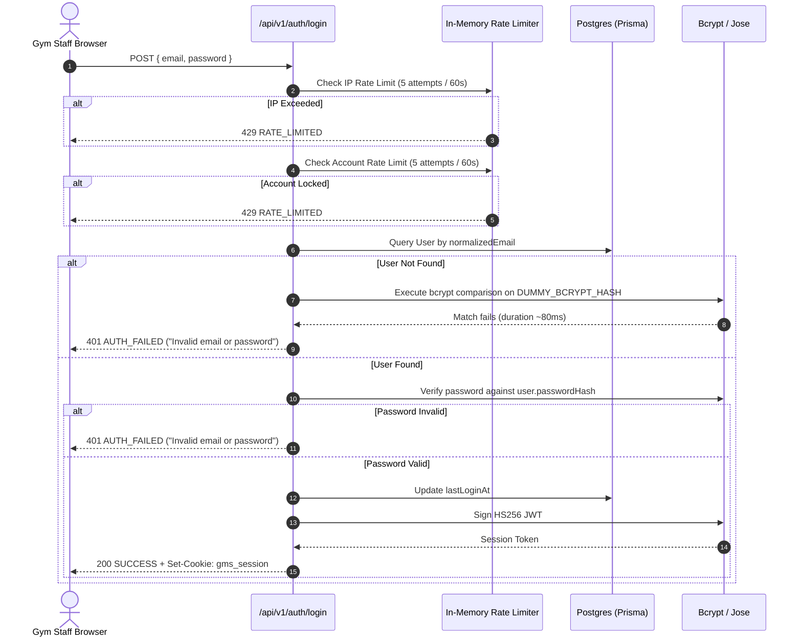

# PRD-03: Security, RBAC & Authentication Specification
## Be Free Fitness (BFF) — Enterprise Gym Management SaaS Platform

**Document Version:** 1.0.0  
**Scope:** Identity Lifecycle, Role-Based Access Control, Cryptographic Signatures, Rate Limiting, and Tenant Isolation  

---

### 1. Identity & Session Lifecycle

The platform enforces stateless, cryptographically signed HTTP-only JWT sessions. Staff identity and tenant context are verified on every incoming request.

#### 1.1 Session Token Format & Signing
* **Engine:** `jose` (v6.2.12) implementing standard `HS256` symmetric signing.
* **Secret Key:** `JWT_SECRET` environment variable (minimum 32 random characters).
* **Token Lifetime:** 7 days (`7d`).
* **Payload Structure:**
  ```typescript
  interface SessionPayload {
    id: string;        // User UUID
    email: string;     // Staff email
    fullName: string;  // Full name for header UI
    role: UserRole;    // Enum: SUPER_ADMIN, GYM_OWNER, etc.
    tenantId: string;  // Tenant UUID for data scoping
  }
  ```

#### 1.2 Session Cookie Configuration
Tokens are encapsulated within an HTTP-only browser cookie named `gms_session`:
* `httpOnly: true` (strictly inaccessible to clientside JavaScript, neutralizing XSS credential theft).
* `secure: process.env.NODE_ENV === "production"` (enforces HTTPS transmission in production).
* `sameSite: "lax"` (mitigates Cross-Site Request Forgery while allowing top-level navigation).
* `maxAge: 7 * 24 * 60 * 60` (7 days in seconds).
* `path: "/"`

---

### 2. Defensive Authentication Architecture

The `/api/v1/auth/login` route implements defense-in-depth security against credential stuffing, brute force, and user enumeration attacks:



#### 2.1 Synthetic Timing Attack Mitigation
To neutralize time-based user enumeration (where attackers measure response latency to determine if an email exists), non-existent users undergo an identical bcrypt calculation using a pre-calculated synthetic hash:
```typescript
const DUMMY_BCRYPT_HASH = "$2a$10$7EqJtq98hPqEX7fNZaFWoO.P8f0z4v2Y1W5b8EaG0G3X0N7B7N7Nu";
```
This guarantees an identical ~80ms cryptographic execution path regardless of whether the account exists.

#### 2.2 Dual-Layer Sliding-Window Rate Limiting
1. **Network Layer Limiter:** Keyed by client IP (`login_ip:${ip}`). Caps requests to 5 attempts per 60 seconds.
2. **Account Layer Limiter:** Keyed by normalized lowercase email (`login_acc:${email}`). Prevents distributed botnets from rotating IPs to crack a single staff account.

---

### 3. Role-Based Access Control (RBAC) Matrix

The system provides 6 discrete roles governed by 12 explicit permissions and module-level routing gates.

#### 3.1 Permissions Definition Matrix

| Permission Key | Description |
| :--- | :--- |
| `MANAGE_TENANT_SETTINGS` | Configure GSTIN, branch invoice prefixes, UPI VPAs, and auto-reminders. |
| `MANAGE_STAFF` | Provision, update, or revoke staff accounts and trainer assignments. |
| `MANAGE_PLANS` | Create and version membership tiers, prices, and durations. |
| `MEMBER_ONBOARDING` | Register new members, upload KYC documents, issue self-join links. |
| `COLLECT_PAYMENTS` | Process POS transactions (Cash, UPI, Card), record UTR bank references. |
| `ISSUE_REFUNDS` | Authorize and record reverse invoice settlements. |
| `FREEZE_CANCEL_MEMBERSHIP` | Pause active memberships or cancel contracts. |
| `VIEW_FINANCIAL_REPORTS` | Access GST tax ledgers, revenue charts, and cash collection totals. |
| `MANUAL_ATTENDANCE` | Manually mark member attendance overrides at reception. |
| `VIEW_ASSIGNED_MEMBERS` | Restricted member directory access for trainers to view their clients. |
| `CONFIGURE_DEVICES` | Register eSSL hardware IP addresses, ports, and generate device API keys. |
| `SEND_BROADCASTS` | Trigger manual or batch WhatsApp announcements. |

#### 3.2 Role-to-Permission Assignment Table

| Role | Permissions Assigned |
| :--- | :--- |
| **`SUPER_ADMIN`** | All 12 permissions granted unconditionally across all tenants. |
| **`GYM_OWNER`** | All 12 permissions granted within their enterprise tenant boundary. |
| **`MANAGER`** | `MANAGE_PLANS`, `MEMBER_ONBOARDING`, `COLLECT_PAYMENTS`, `FREEZE_CANCEL_MEMBERSHIP`, `VIEW_FINANCIAL_REPORTS`, `MANUAL_ATTENDANCE`, `VIEW_ASSIGNED_MEMBERS`, `CONFIGURE_DEVICES`, `SEND_BROADCASTS`. |
| **`FRONT_DESK`** | `MEMBER_ONBOARDING`, `COLLECT_PAYMENTS`, `MANUAL_ATTENDANCE`. |
| **`TRAINER`** | `VIEW_ASSIGNED_MEMBERS`. |
| **`ACCOUNTANT`** | `COLLECT_PAYMENTS`, `ISSUE_REFUNDS`, `VIEW_FINANCIAL_REPORTS`. |

#### 3.3 Module Access Gates (`canAccessModule`)

| Operational Module | Minimum Required Permission or Role Override |
| :--- | :--- |
| `/billing` | `COLLECT_PAYMENTS` or `VIEW_FINANCIAL_REPORTS` |
| `/members` | `MEMBER_ONBOARDING` or `VIEW_ASSIGNED_MEMBERS` |
| `/attendance` | `MANUAL_ATTENDANCE` or Role: `GYM_OWNER` / `MANAGER` |
| `/settings` | `MANAGE_TENANT_SETTINGS` or `MANAGE_PLANS` |
| `/reports` | `VIEW_FINANCIAL_REPORTS` |
| `/devices` | `CONFIGURE_DEVICES` |

---

### 4. Client Self-Registration Cryptographic Invite Tokens

To permit prospective members to self-register on their own smartphones without requiring a pre-existing password, the system issues tamper-proof cryptographic tokens:
* **Token Structure:** Standard JWT signed with `HS256` containing `{ tenantId, gymName, clientName?, clientPhone?, type: "client_invite" }`.
* **Validity Window:** Configurable by reception staff upon creation: 24 Hours, 48 Hours, or 7 Days.
* **Tamper Resistance:** Any manipulation of the URL query parameter (e.g. modifying `tenantId` to access another branch's portal) immediately fails cryptographic verification via `jwtVerify`, returning `400 Bad Request`.

---

### 5. Webhook Timing-Safe HMAC-SHA256 Verification

When Razorpay dispatches asynchronous payment notifications (e.g. `payment_link.paid`), the payload is verified using constant-time cryptographic equality:
```typescript
const expectedSignature = crypto
  .createHmac("sha256", secret)
  .update(rawBody)
  .digest("hex");

const expectedBuffer = Buffer.from(expectedSignature, "utf8");
const signatureBuffer = Buffer.from(signature, "utf8");

if (expectedBuffer.length !== signatureBuffer.length) {
  return false;
}

return crypto.timingSafeEqual(expectedBuffer, signatureBuffer);
```
This protects the billing engine from forged webhooks and timing side-channel exploits.

---

### 6. HTTP Security Headers

Next.js Edge Middleware (`middleware.ts`) automatically injects security headers across all responses:
* `X-Frame-Options: DENY` (prevents clickjacking attacks via iframe embedding).
* `X-Content-Type-Options: nosniff` (forces strict MIME type sniffing compliance).
* `Referrer-Policy: strict-origin-when-cross-origin` (prevents leaking sensitive query strings).
* `Permissions-Policy: camera=(), microphone=(), geolocation=()` (restricts browser device access).
