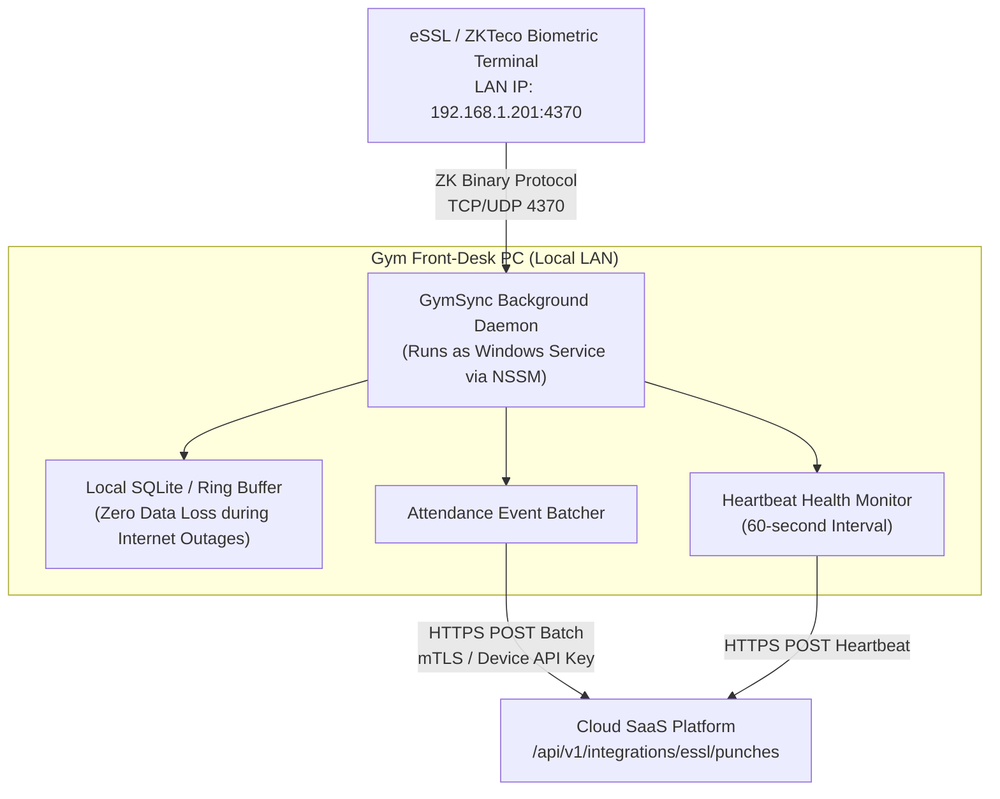

# PRD-06: Hardware Edge Agent Specification (`GymSync`)
## Be Free Fitness (BFF) — Enterprise Gym Management SaaS Platform

**Document Version:** 1.0.0  
**Scope:** On-Premise Biometric Edge Connector, Protocol Bridging, Offline Buffering, and Windows Service Deployment  

---

### 1. Executive Purpose & Problem Statement

Most Indian fitness centers utilize local standalone biometric terminals (e.g. eSSL K90, SilkBio-101TC, ZKTeco MB20, uFace series) connected to the local gym LAN. Because these devices reside behind commercial NAT firewalls without public static IPs, cloud SaaS platforms cannot establish inbound TCP connections directly to the physical devices.

**`GymSync`** is an ultra-lightweight, resilient background daemon running on the gym's front-desk Windows workstation. It creates an outbound tunnel bridging on-premise biometric hardware with the Be Free Fitness cloud SaaS.

---

### 2. Edge Topology & Architecture



---

### 3. Core Functional Components

#### 3.1 ZK Protocol Ingestion Engine
* Connects to the local biometric terminal via TCP socket on port `4370`.
* Periodically polls the device event log or listens to real-time attendance push events (`OnAttTransactionEx`).
* Normalizes raw hardware event structs into standardized punch objects:
  ```typescript
  interface RawHardwarePunch {
    enrollmentId: number;   // User ID configured inside terminal firmware
    timestamp: Date;        // Punch timestamp from internal RTC clock
    verifiedMode: number;   // 1 = Fingerprint, 2 = Face, 4 = RFID Card, 15 = Password
    direction: number;      // 0 = Check In, 1 = Check Out
  }
  ```

#### 3.2 Resilient Offline Local Ring Buffer
* When local internet connectivity is disrupted (e.g. broadband downtime), incoming biometric swipes are saved immediately into a persistent local queue (SQLite or disk-backed journal).
* Prevents data loss during peak gym rush hours.
* Upon internet restoration, the queue flushes transactions chronologically to `/api/v1/integrations/essl/punches` with exponential backoff.

#### 3.3 Heartbeat & Device Status Monitor
* Every 60 seconds, `GymSync` dispatches a ping payload to the cloud:
  ```json
  {
    "deviceSerial": "ESSL-KULLU-01",
    "status": "ONLINE",
    "firmwareVersion": "Ver 6.60 Nov 18 2024",
    "enrolledUserCount": 342,
    "unflushedPunches": 0
  }
  ```
* If the cloud platform misses 3 consecutive heartbeats (3 minutes), the device status in `/devices` switches to `OFFLINE`, alerting reception staff.

---

### 4. Configuration Parameters

The daemon is configured via environment variables or a local `.env` file:

| Environment Variable | Mandatory | Default | Description |
| :--- | :--- | :--- | :--- |
| `CLOUD_API_URL` | Yes | — | Canonical cloud SaaS URL (e.g. `https://app.befreefitness.in`). |
| `DEVICE_SERIAL` | Yes | — | Hardware identifier matching `Device.serialNumber` in database. |
| `DEVICE_API_KEY` | Yes | — | Cryptographic secret verified against `Device.apiKeyHash`. |
| `TERMINAL_IP` | Yes | `192.168.1.201`| Static IP address assigned to the physical eSSL turnstile. |
| `TERMINAL_PORT` | No | `4370` | Standard ZKTeco TCP/UDP communication port. |
| `SYNC_INTERVAL_SEC` | No | `10` | Interval between punch batch flushes to the cloud. |
| `HEARTBEAT_SEC` | No | `60` | Interval between device health pings. |

---

### 5. Deployment as a Windows Service

To ensure 24/7 autonomous execution without requiring staff to keep a terminal window open:

#### Step 1: Package Daemon into Standalone Executable
Using Vercel's `pkg` utility, package TypeScript/Node script into a standalone self-contained binary:
```bash
npx pkg edge-agent/gymsync.ts --targets node18-win-x64 --output GymSync.exe
```

#### Step 2: Install as Windows Service via NSSM
Use **NSSM (Non-Sucking Service Manager)** to register `GymSync.exe` as an auto-starting Windows Service:
```cmd
nssm install GymSync "C:\GymSync\GymSync.exe"
nssm set GymSync AppDirectory "C:\GymSync"
nssm set GymSync AppEnvironmentExtra CLOUD_API_URL=https://app.befreefitness.in DEVICE_SERIAL=ESSL-DELHI-01 DEVICE_API_KEY=sec_live_998877
nssm set GymSync Start SERVICE_AUTO_START
nssm set GymSync AppThrottle 1500
nssm set GymSync AppStdout "C:\GymSync\logs\stdout.log"
nssm set GymSync AppStderr "C:\GymSync\logs\stderr.log"
nssm start GymSync
```

#### Step 3: Verify Service Status
```cmd
sc query GymSync
```
Returns `STATE: 4 RUNNING`. The service will now automatically reboot if the reception PC restarts.
